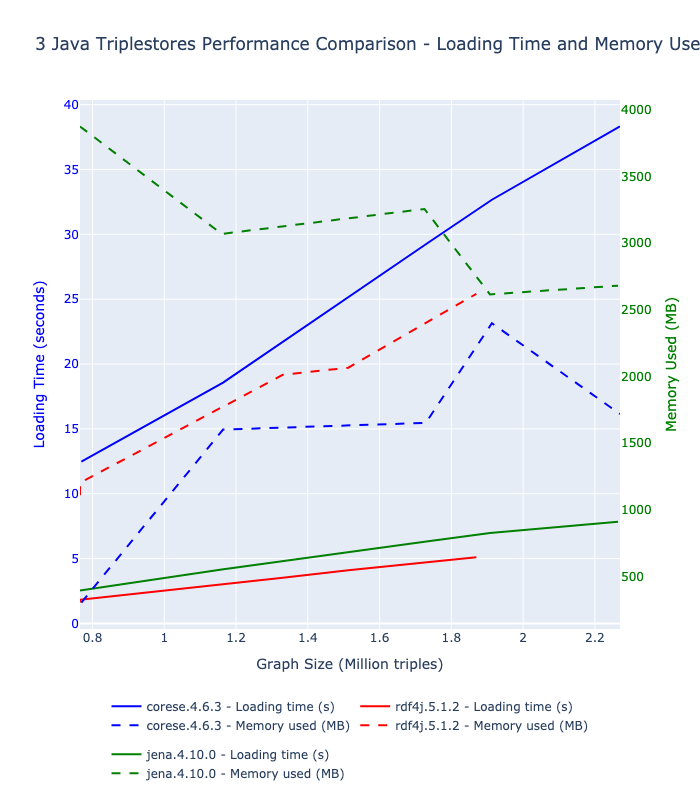
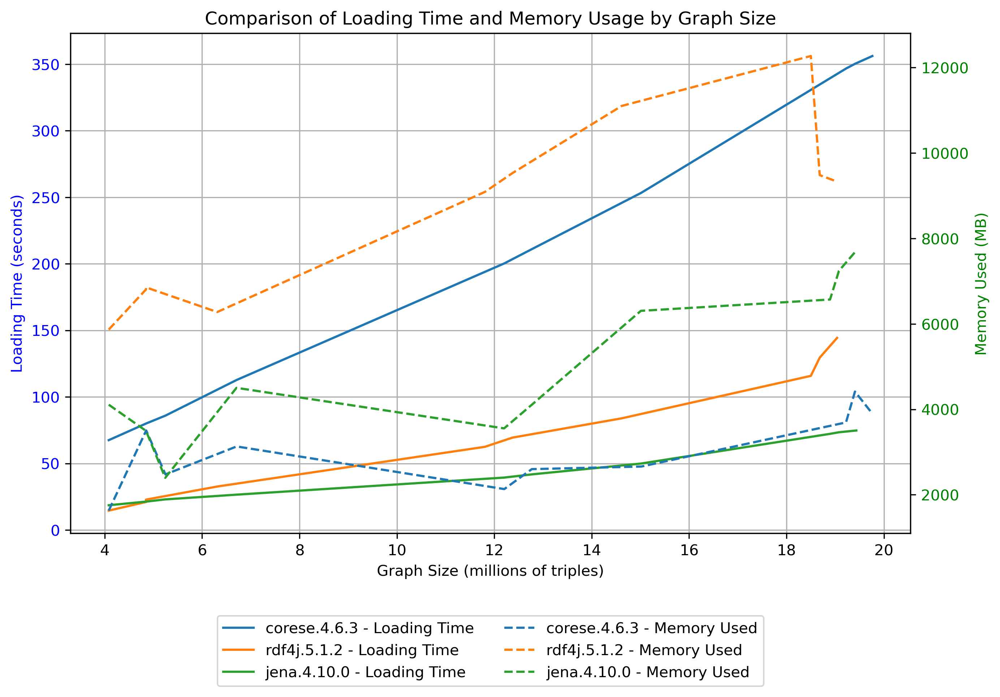

# Benchmark dashboard

## Loading time and memory comparison

**Triple stores compared**
* Corese
* RDF4J
* Jena 

**Metrics measured**

measured after  each file has loaded sucessfuly 
* loading time 
* memory used

### Results 

* If you just run the [`python-utils/plot-compare.py`](./../python-utils/plot-compare.py) script yourself, this is the resulting plot
* Or if you just browse this repository, this is the commited results of the commiter's latest run.

The plots below show the loading time and memory used after each file of the dataset has been succesfuly loaded.

 

### Archived results

Results reported below are from previous run, using 2 specific datasets, run on the 2025.04.11

#### DBPedia dataset

### Variant comparing Latest and previous version of Corese

#### DBpedia dataset

