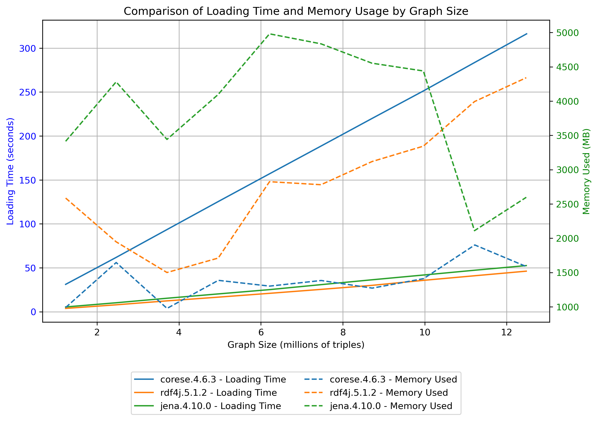

# Becnhmark dashboard

## Loading time and memory comparison

**Triple stores compared**
* Corese
* RDF4J
* Jena 

The corresponding versions of each triplestore is given in the plot below

**Data set loaded** : the bowlogna becnhmark dataset (from [this link](https://files.dice-research.org/projects/HOBBIT/benchmarks-data/datasets-dumps/bowlogna-dump.zip))

**Dataset description** : Synthetic dataset built according a model describing relations between students, universities, and course programs. It's made of 10 files, formally equivalent, but containing each different data. Each file loaded adds ~1.2 million triples

**Reference article** : [SIMPDA2011 paper](https://exascale.info/assets/pdf/BowlognaBenchSIMPDA2011.pdf)

The plot below shows the loading time and memory used after each one of the 10 files of the dataset has been succesfuly loaded

