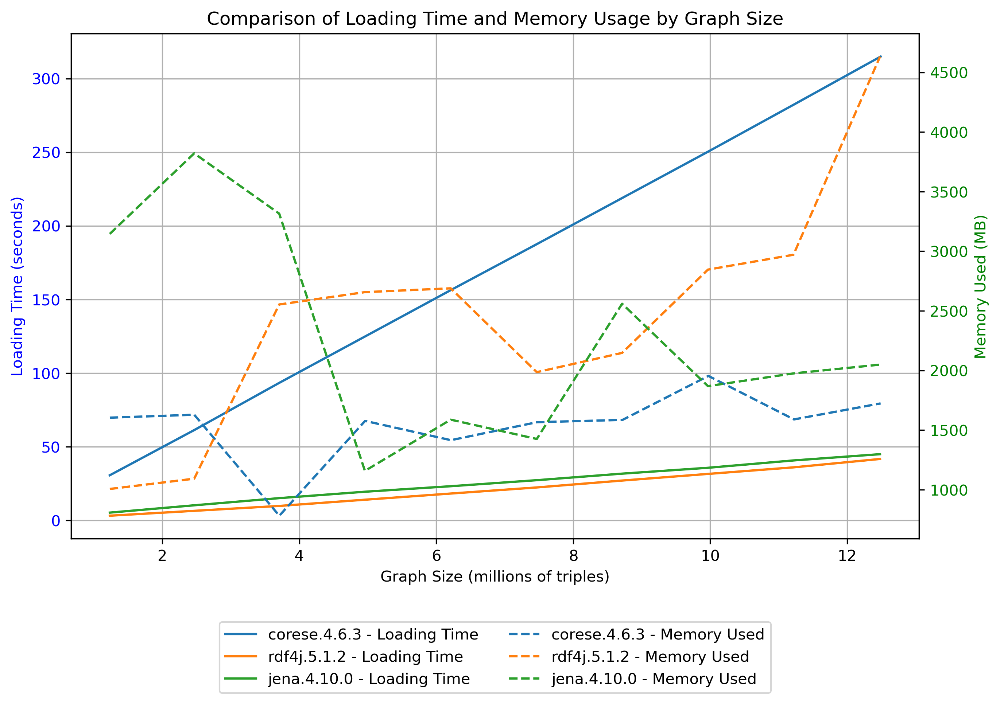
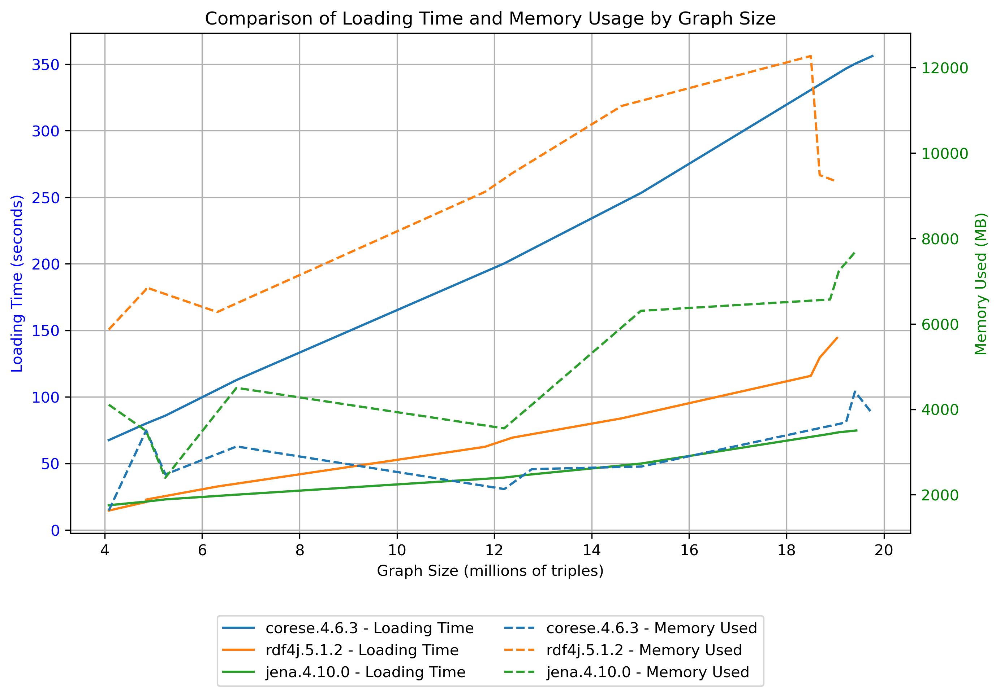
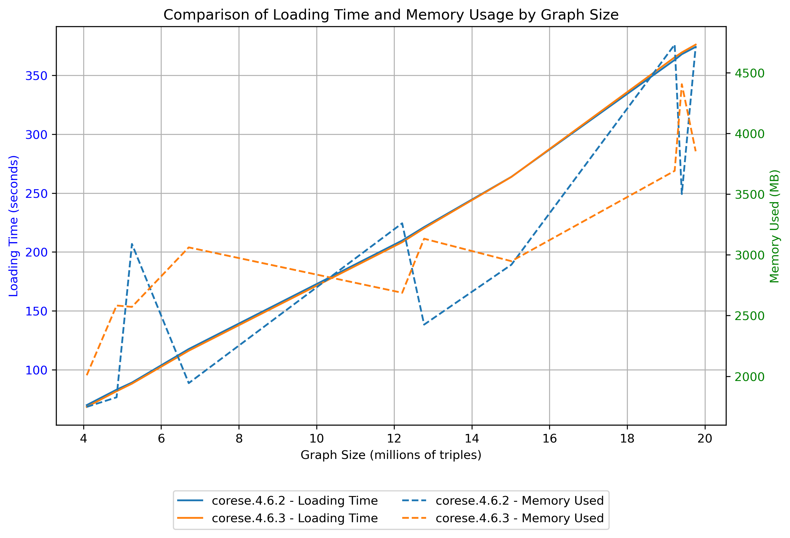

# Benchmark dashboard

## Loading time and memory comparison

**Triple stores compared**
* Corese
* RDF4J
* Jena 

**Metrics measured**

measured after  each file has loaded sucessfuly 
* loading time 
* memory used

### Results 

The plots below show the loading time and memory used after each one of the 10 files of the dataset has been succesfuly loaded

#### Bowlogna dataset

#### DBPedia dataset

### Variant comparing Latest and previous version of Corese

#### DBpedia dataset

